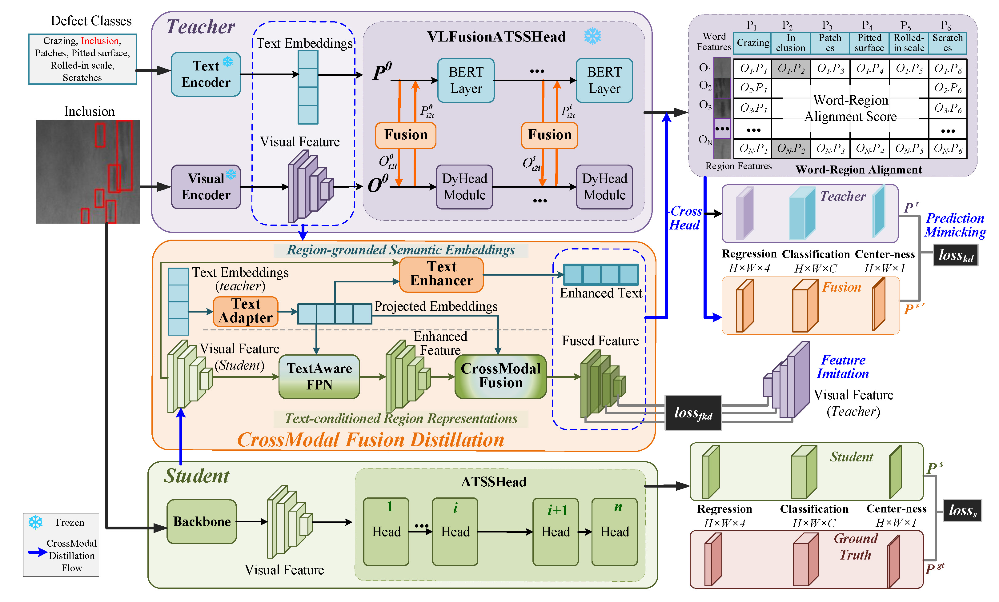

# <p align=center>  🌟 `FusionKD: Fusion Knowledge Distillation of Vision-Language Foundation Model for Strip Steel Surface Defect Detection` 🌟 </p>

 

This repository contains the official implementation of the following paper:

> **FusionKD: Fusion Knowledge Distillation of Vision-Language Foundation Model for Strip Steel Surface Defect Detection**<br>
> [Jiaojiao Su](https://dblp.org/pid/278/9920.html)<sup></sup>, [Qiwu Luo](https://scholar.google.com.hk/citations?hl=zh-CN&user=cI6HFdwAAAAJ)<sup>\*</sup>, [Yibo Wang](https://scholar.google.com/citations?hl=zh-CN&tzom=-480&user=jkINzwMAAAAJ)<sup>\*</sup>, [Chunhua Yang](https://scholar.google.com.hk/citations?hl=zh-CN&user=39DpNi0AAAAJ), [Weihua Gui](https://dblp.org/pid/71/2277-1.html), [Janne Heikkilä](https://scholar.google.com.hk/citations?hl=zh-CN&user=SCR4RY8AAAAJ)<sup></sup>  <br>
> (\* denotes equal contribution) <br>
> School of Automation, Central South University <br>
> Center for Machine Vision and Signal Analysis (CMVS),University of Oulu <br>

[[In-press Paper](https://doi.org/10.1016/j.inffus.2025.103940)]

## Introduction

Accurate surface defect detection in strip steel is vital for industrial quality control but challenges existing methods in real-time performance and generalization. While Vision-Language Foundation Models (VLMs) offer superior recognition, their computational cost hinders deployment. This paper presents FusionKD, a novel knowledge distillation framework that transfers rich multimodal knowledge from a frozen large-scale VLM to a highly efficient, vision-only student detector. To bridge the architectural gap between the teacher and student, FusionKD introduces three key technical contributions: first, a cross-modal fusion distillation module that establishes bidirectional alignment between visual features and linguistic embeddings, enabling the student to assimilate semantic knowledge without text input; second, a cross-head word-region alignment mechanism that enhances the student’s ability to learn fine-grained spatial-semantic associations akin to the teacher’s reasoning; and third, a fused knowledge distillation loss formulated around the Pearson correlation coefficient to ensure stable training by optimizing feature correlation and mitigating optimization instability. To address the inherent optimization instability, we further propose a Dynamic Knowledge Coordination (DKC) framework that stabilizes training through phase-adaptive scheduling, gradient conflict resolution, and adaptive temperature annealing. Extensive experiments on the NEU-DET dataset show that FusionKD achieves 77.8–80.0 mAP with a 3.8 ×  speedup and 5.3 ×  parameter reduction over the teacher model, while maintaining  ≤  2.6% accuracy degradation. The integrated DKC framework provides consistent performance gains, validating its efficacy in mitigating optimization instability caused by capacity disparity. Cross-dataset validation on PCB and GC10-DET further confirms its superior generalization capability.



## Get Started

### 1. Prerequisites

**Dependencies**

- Ubuntu >= 20.04
- CUDA >= 11.3
- pytorch==1.12.1
- torchvision=0.13.1
- mmcv==2.0.0rc4
- mmengine==0.7.3

Our implementation based on MMDetection==3.0.0rc6. For more information about installation, please see the [official instructions](https://mmdetection.readthedocs.io/en/3.x/).

**Step 0.** Create Conda Environment

```shell
conda create --name fusionkd python=3.8 -y
conda activate fusionkd
```

**Step 1.** Install [Pytorch](https://pytorch.org)

```shell
conda install pytorch==1.12.1 torchvision==0.13.1 torchaudio==0.12.1 cudatoolkit=11.3 -c pytorch
```

**Step 2.** Install [MMEngine](https://github.com/open-mmlab/mmengine) and [MMCV](https://github.com/open-mmlab/mmcv) using [MIM](https://github.com/open-mmlab/mim).

```shell
pip install -U openmim
mim install "mmengine==0.7.3"
mim install "mmcv==2.0.0rc4"
```

**Step 3.** Install [CrossKD](https://github.com/jbwang1997/CrossKD.git).

```shell
git clone https://github.com/Miss-Jo/FusionKD
cd FusionKD
pip install -v -e .
# "-v" means verbose, or more output
# "-e" means installing a project in editable mode,
# thus any local modifications made to the code will take effect without reinstallation.
```

**Step 4.** Prepare dataset follow the [official instructions](https://mmdetection.readthedocs.io/en/3.x/user_guides/dataset_prepare.html).


**Step 5.** Please download the pretrained GLIP-Tiny model weights from [Hugging Face](https://huggingface.co/GLIPModel/GLIP/blob/main/glip_tiny_model_o365_goldg_cc_sbu.pth) and save them to the **checkpoint** directory.

### 2. Training

**Single GPU**

```shell
python tools/train.py configs/fusionkd/${CONFIG_FILE} [optional arguments]
```

**Multi GPU**

```shell
CUDA_VISIBLE_DEVICES=x,x,x,x python tools/dist_train.sh \
    configs/fusionkd/${CONFIG_FILE} ${GPU_NUM} [optional arguments]
```

### 3. Evaluation

```shell
python tools/test.py configs/fusionkd/${CONFIG_FILE} ${CHECKPOINT_FILE}
```


## Citation

If you find our repo useful for your research, please cite us:

```
@article{SU2025103940,
title = {FusionKD: Fusion Knowledge Distillation of Vision-Language Foundation Model for Strip Steel Surface Defect Detection},
journal = {Information Fusion},
pages = {103940},
year = {2025},
issn = {1566-2535},
doi = {https://doi.org/10.1016/j.inffus.2025.103940},
url = {https://www.sciencedirect.com/science/article/pii/S1566253525010024},
author = {Jiaojiao Su and Qiwu Luo and Yibo Wang and Chunhua Yang and Weihua Gui and Janne Heikkilä},
keywords = {Cross-Modal Fusion, Knowledge Distillation, Vision-Language Foundation Model, Strip Steel, Industrial Defect Detection},
abstract = {Accurate surface defect detection in strip steel is vital for industrial quality control but challenges existing methods in real-time performance and generalization. While Vision-Language Foundation Models (VLMs) offer superior recognition, their computational cost hinders deployment. This paper presents FusionKD, a novel knowledge distillation framework that transfers rich multimodal knowledge from a frozen large-scale VLM to a highly efficient, vision-only student detector. To bridge the architectural gap between the teacher and student, FusionKD introduces three key technical contributions: first, a cross-modal fusion distillation module that establishes bidirectional alignment between visual features and linguistic embeddings, enabling the student to assimilate semantic knowledge without text input; second, a cross-head word-region alignment mechanism that enhances the student’s ability to learn fine-grained spatial-semantic associations akin to the teacher’s reasoning; and third, a fused knowledge distillation loss formulated around the Pearson correlation coefficient to ensure stable training by optimizing feature correlation and mitigating optimization instability. To address the inherent optimization instability, we further propose a Dynamic Knowledge Coordination (DKC) framework that stabilizes training through phase-adaptive scheduling, gradient conflict resolution, and adaptive temperature annealing. Extensive experiments on the NEU-DET dataset show that FusionKD achieves 77.8–80.0 mAP with a 3.8 ×  speedup and 5.3 ×  parameter reduction over the teacher model, while maintaining  ≤  2.6% accuracy degradation. The integrated DKC framework provides consistent performance gains, validating its efficacy in mitigating optimization instability caused by capacity disparity. Cross-dataset validation on PCB and GC10-DET further confirms its superior generalization capability. Code will be released upon publication.}
}
```

This project is based on the open source codebase [CrossKD](https://github.com/jbwang1997/CrossKD).
```
@article{mmdetection,
  title   = {{MMDetection}: Open MMLab Detection Toolbox and Benchmark},
  author  = {Chen, Kai and Wang, Jiaqi and Pang, Jiangmiao and Cao, Yuhang and
             Xiong, Yu and Li, Xiaoxiao and Sun, Shuyang and Feng, Wansen and
             Liu, Ziwei and Xu, Jiarui and Zhang, Zheng and Cheng, Dazhi and
             Zhu, Chenchen and Cheng, Tianheng and Zhao, Qijie and Li, Buyu and
             Lu, Xin and Zhu, Rui and Wu, Yue and Dai, Jifeng and Wang, Jingdong
             and Shi, Jianping and Ouyang, Wanli and Loy, Chen Change and Lin, Dahua},
  journal= {arXiv preprint arXiv:1906.07155},
  year={2019}
}
```

This project is also based on the open source codebase [MMDetection](https://github.com/open-mmlab/mmdetection).
```
@article{mmdetection,
  title   = {{MMDetection}: Open MMLab Detection Toolbox and Benchmark},
  author  = {Chen, Kai and Wang, Jiaqi and Pang, Jiangmiao and Cao, Yuhang and
             Xiong, Yu and Li, Xiaoxiao and Sun, Shuyang and Feng, Wansen and
             Liu, Ziwei and Xu, Jiarui and Zhang, Zheng and Cheng, Dazhi and
             Zhu, Chenchen and Cheng, Tianheng and Zhao, Qijie and Li, Buyu and
             Lu, Xin and Zhu, Rui and Wu, Yue and Dai, Jifeng and Wang, Jingdong
             and Shi, Jianping and Ouyang, Wanli and Loy, Chen Change and Lin, Dahua},
  journal= {arXiv preprint arXiv:1906.07155},
  year={2019}
}
```
We implement our vision-language model using the official [GLIP](https://github.com/microsoft/GLIP).

```
@inproceedings{li2021grounded,
      title={Grounded Language-Image Pre-training},
      author={Liunian Harold Li* and Pengchuan Zhang* and Haotian Zhang* and Jianwei Yang and Chunyuan Li and Yiwu Zhong and Lijuan Wang and Lu Yuan and Lei Zhang and Jenq-Neng Hwang and Kai-Wei Chang and Jianfeng Gao},
      year={2022},
      booktitle={CVPR},
}
}
```
## License

Licensed under a [Creative Commons Attribution-NonCommercial 4.0 International](https://creativecommons.org/licenses/by-nc/4.0/) for Non-commercial use only. Any commercial use should get formal permission first.

## Contact

For technical questions, please contact `224601039@csu.edu.cn` and `3513106846@qq.com`.

## Acknowledgement

This repo is modified from open source object detection codebase [MMDetection](https://github.com/open-mmlab/mmdetection) and knowledge distilliation codebase [CrossKD](https://github.com/jbwang1997/CrossKD).
